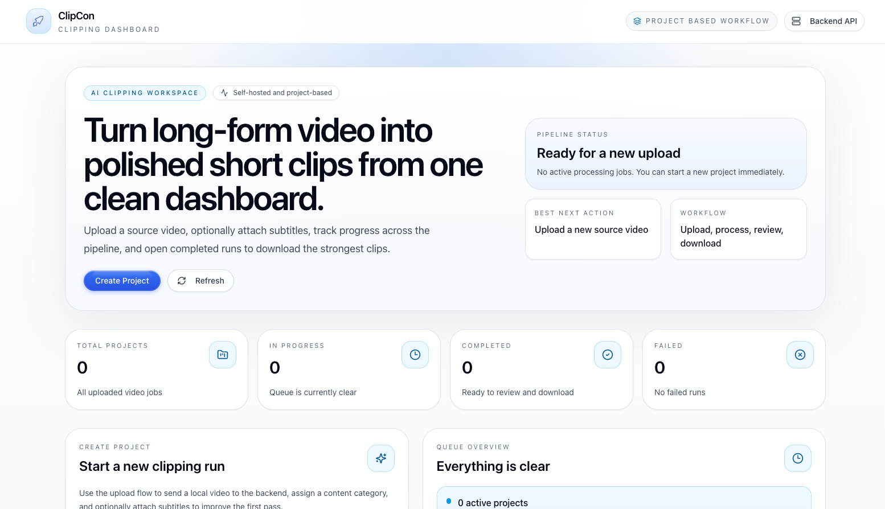

# ClipAgent

<p align="center">
  Self-hosted AI video clipping dashboard for turning long-form videos into short, shareable clips.
</p>

<p align="center">
  <a href="./docs/QUICKSTART.md">Quickstart</a> ·
  <a href="./docs/ARCHITECTURE.md">Architecture</a> ·
  <a href="./CONTRIBUTING.md">Contributing</a> ·
  <a href="./LICENSE">License</a>
</p>

<p align="center">
  
</p>

## Overview

ClipAgent is an open-source clipping tool built for local or self-hosted use.

It gives you a clean dashboard for:

- uploading a source video and optional subtitle file
- creating a project and triggering the backend pipeline
- monitoring processing status
- reviewing generated clips
- downloading final rendered outputs

## What’s Inside

### `clipping-tool-be/`

FastAPI backend for:

- project creation and storage
- transcript analysis
- clip scoring
- title generation
- clustering
- video rendering

### `clipping-tool-ui/`

Next.js frontend for:

- project dashboard
- upload flow
- project monitoring
- clip review and download

## Main Features

- Project-based workflow aligned to `/api/v1/projects/*`
- English-only active prompts
- OpenRouter and xAI Grok provider support
- Local-first upload and review flow
- Optional auth surface isolated from the main product path
- Open-source-friendly docs and monorepo structure

## Quickstart

### 1. Start the backend

```bash
cd clipping-tool-be
python3 -m venv .venv
source .venv/bin/activate
pip install -r requirements.txt
cp .env.example .env
uvicorn app.main:app --reload --host 0.0.0.0 --port 8000
```

### 2. Start the frontend

```bash
cd clipping-tool-ui
npm install
cp .env.example .env.local
npm run dev
```

### 3. Open the app

Visit `http://localhost:3000`

For the full setup flow, see [docs/QUICKSTART.md](./docs/QUICKSTART.md).

## Repository Layout

```text
.
├── clipping-tool-be/      # FastAPI backend and clipping pipeline
├── clipping-tool-ui/      # Next.js frontend
├── docs/                  # Canonical repo-level documentation
├── CONTRIBUTING.md
├── LICENSE
└── README.md
```

## Documentation

- [docs/QUICKSTART.md](./docs/QUICKSTART.md)
- [docs/ARCHITECTURE.md](./docs/ARCHITECTURE.md)
- [CONTRIBUTING.md](./CONTRIBUTING.md)
- [clipping-tool-be/README.md](./clipping-tool-be/README.md)
- [clipping-tool-ui/README.md](./clipping-tool-ui/README.md)

## Open Source Status

The main clipping flow is ready and productized:

- dashboard-based UI
- backend-aligned project APIs
- upload, processing, review, and download flow
- cleaned billing and credits surface
- build-verified frontend

Remaining decisions before a final public polish pass:

- whether to keep or remove the optional auth API routes
- how much older planning documentation should remain in the public repo
- whether to keep both the root `LICENSE` and the backend-local `LICENSE`

## License

This repository is licensed under the MIT License. See [LICENSE](./LICENSE).
