# ClipAgent MVP - Architecture Diagrams

This document provides comprehensive visual diagrams of the ClipAgent MVP system architecture, data flow, and component interactions.

---

## Table of Contents

- [System Architecture Overview](#system-architecture-overview)
- [Component Architecture](#component-architecture)
- [Data Flow Architecture](#data-flow-architecture)
- [Processing Pipeline Architecture](#processing-pipeline-architecture)
- [LLM Integration Architecture](#llm-integration-architecture)
- [Storage Architecture](#storage-architecture)
- [Deployment Architecture](#deployment-architecture)

---

## System Architecture Overview

### High-Level System Architecture

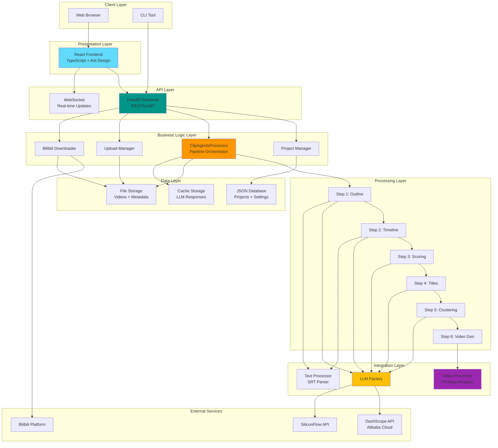

---

## Component Architecture

### Backend Component Diagram

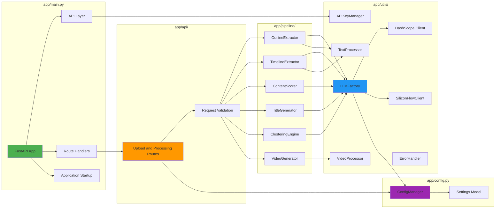

### Frontend Component Diagram

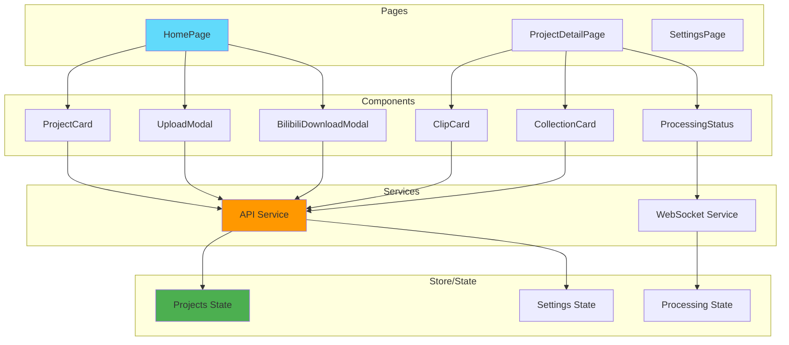

---

## Data Flow Architecture

### Complete Data Flow Diagram

```mermaid
flowchart TD
    Start([User Uploads Video + SRT]) --> A[FastAPI Receives Upload]
    A --> B{Validate Files}
    B -->|Invalid| Error1[Return Error]
    B -->|Valid| C[Create Project ID]
    
    C --> D[Save to uploads/project_id/input/]
    D --> E[Initialize Project Metadata]
    E --> F[Start Processing Pipeline]
    
    F --> G[Parse SRT File]
    G --> H[Chunk Text 30min/5000chars]
    H --> I1[Step 1: Outline Extraction]
    
    I1 --> I1A[Load Outline Prompt]
    I1A --> I1B[For Each Chunk]
    I1B --> I1C{LLM Call}
    I1C -->|Success| I1D[Parse Topics]
    I1C -->|Failure| I1E[Retry 3x]
    I1E -->|Still Fails| Error2[Log Error]
    I1D --> I1F[Merge & Dedupe]
    I1F --> I1G[Save step1_outline.json]
    
    I1G --> I2[Step 2: Timeline Mapping]
    I2 --> I2A[Load Timeline Prompt]
    I2A --> I2B[Match Topics to SRT]
    I2B --> I2C{LLM Call}
    I2C --> I2D[Validate Timestamps]
    I2D --> I2E[Convert SRT → FFmpeg Time]
    I2E --> I2F[Save step2_timeline.json]
    
    I2F --> I3[Step 3: Content Scoring]
    I3 --> I3A[Load Scoring Prompt]
    I3A --> I3B[For Each Clip]
    I3B --> I3C{LLM Score 4 Dimensions}
    I3C --> I3D[Calculate Final Score]
    I3D --> I3E{Score >= 0.7?}
    I3E -->|No| I3F[Filter Out]
    I3E -->|Yes| I3G[Keep Clip]
    I3G --> I3H[Save step3_scoring.json]
    
    I3H --> I4[Step 4: Title Generation]
    I4 --> I4A[Load Title Prompt]
    I4A --> I4B[For Each High-Score Clip]
    I4B --> I4C{LLM Generate Title}
    I4C --> I4D[Validate Title Quality]
    I4D --> I4E[Save step4_titles.json]
    
    I4E --> I5[Step 5: Thematic Clustering]
    I5 --> I5A[Load Clustering Prompt]
    I5A --> I5B[Send All Clips to LLM]
    I5B --> I5C{LLM Group by Theme}
    I5C --> I5D[Create Collections 2-5 clips]
    I5D --> I5E[Generate Collection Metadata]
    I5E --> I5F[Save step5_clustering.json]
    
    I5F --> I6[Step 6: Video Generation]
    I6 --> I6A[For Each Clip]
    I6A --> I6B{FFmpeg Extract}
    I6B -->|Success| I6C[Save to clips/]
    I6B -->|Failure| I6D[Retry with Fallback]
    I6C --> I6E[For Each Collection]
    I6E --> I6F{FFmpeg Concatenate}
    I6F --> I6G[Save to collections/]
    I6G --> I6H[Save Final Metadata]
    
    I6H --> End([Processing Complete])
    
    style Start fill:#4caf50
    style End fill:#4caf50
    style I1 fill:#e3f2fd
    style I2 fill:#e3f2fd
    style I3 fill:#e3f2fd
    style I4 fill:#e3f2fd
    style I5 fill:#e3f2fd
    style I6 fill:#e3f2fd
    style Error1 fill:#ffcdd2
    style Error2 fill:#ffcdd2
```

### Request-Response Flow

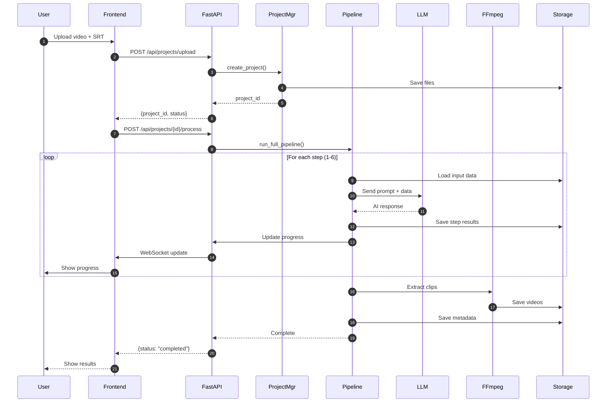

---

## Processing Pipeline Architecture

### 6-Step Pipeline Flow

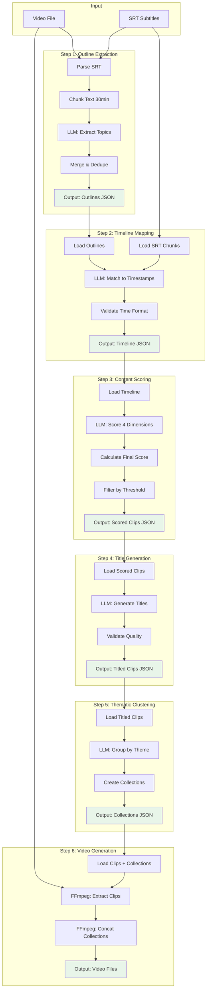

### Pipeline State Machine

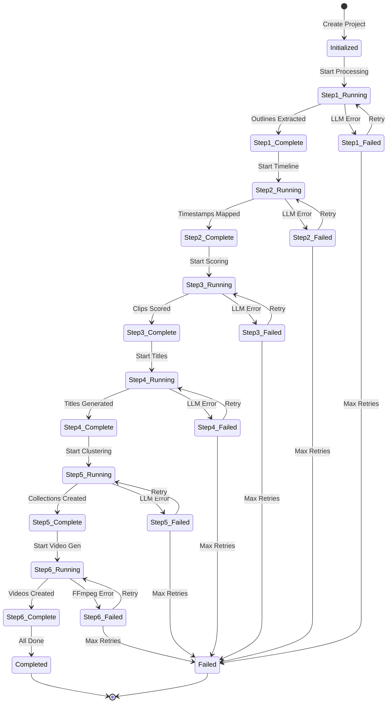

---

## LLM Integration Architecture

### LLM Factory Pattern

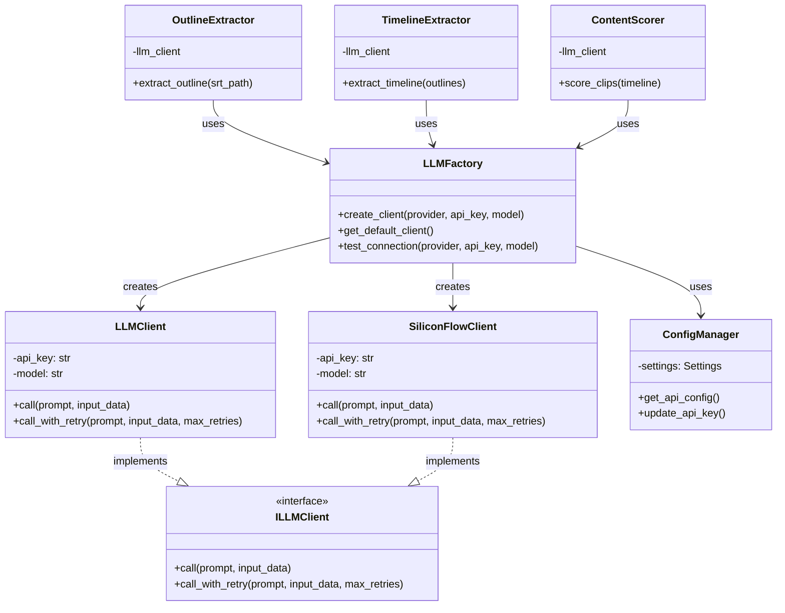

### LLM Request Flow

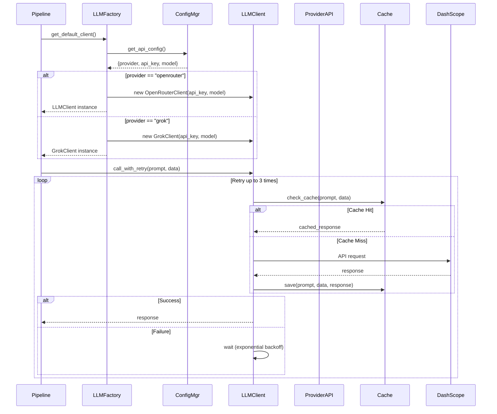

---

## Storage Architecture

### File System Structure

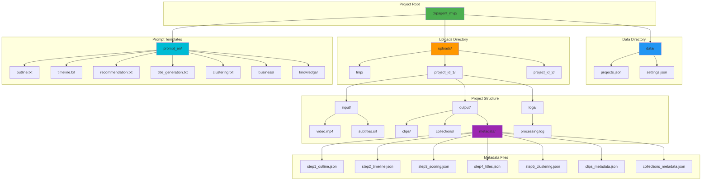

### Data Model Relationships

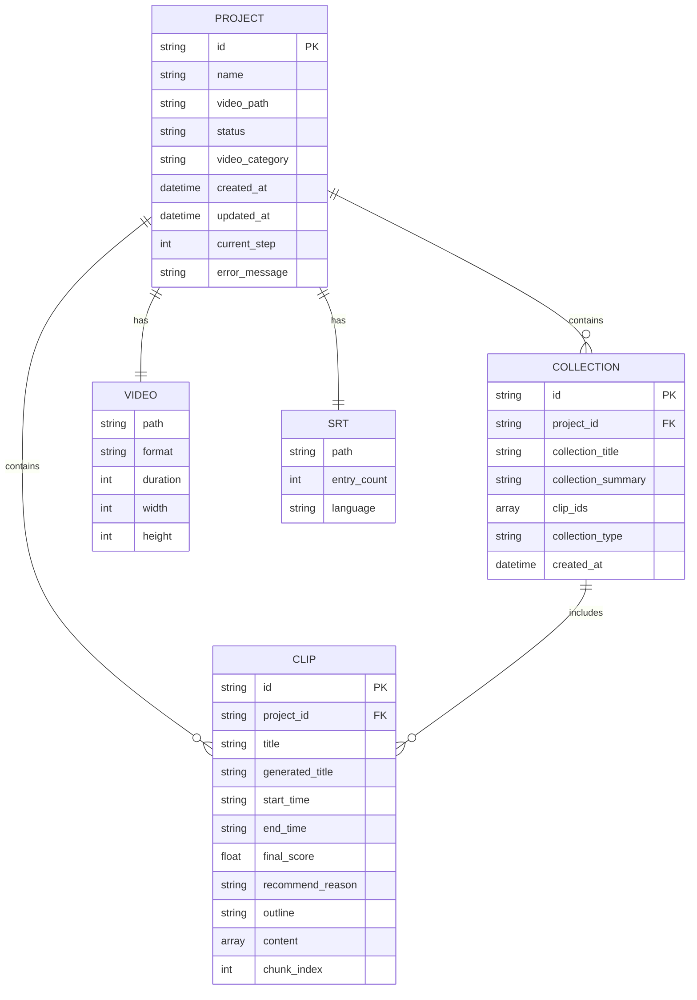

---

## Deployment Architecture

### Docker Deployment

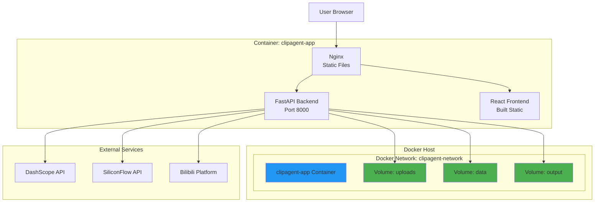

### Production Deployment Architecture

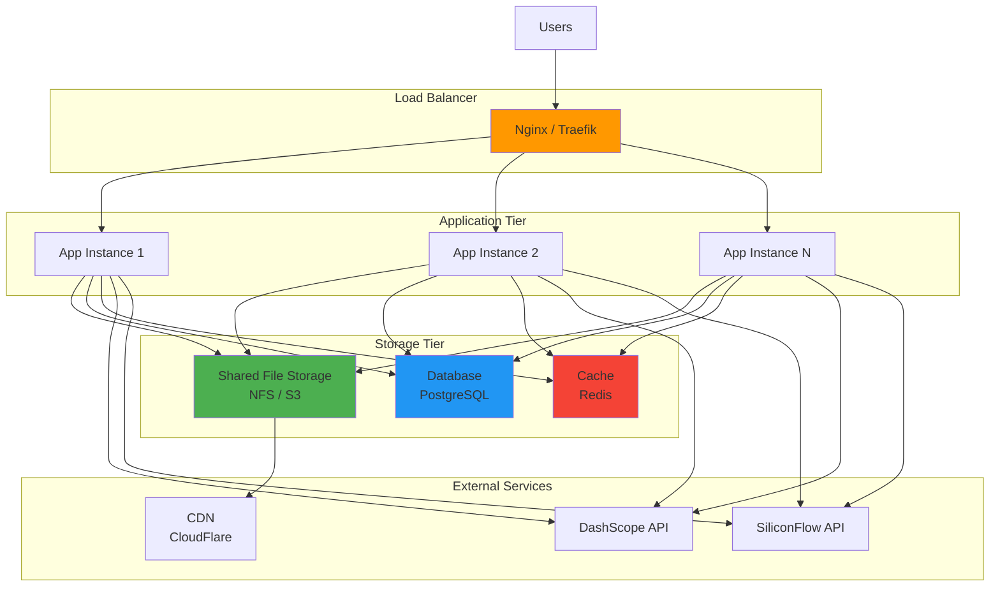

---

## Conclusion

These architecture diagrams provide a comprehensive visual understanding of the ClipAgent MVP system:

1. **System Architecture**: Shows the overall layered architecture from client to data storage
2. **Component Architecture**: Details the internal structure of backend and frontend components
3. **Data Flow**: Illustrates how data moves through the system from upload to final output
4. **Processing Pipeline**: Visualizes the 6-step video processing workflow
5. **LLM Integration**: Explains the factory pattern and provider abstraction
6. **Storage Architecture**: Maps out the file system and data model relationships
7. **Deployment Architecture**: Shows Docker and production deployment configurations

These diagrams serve as a reference for understanding, maintaining, and extending the ClipAgent MVP system.
