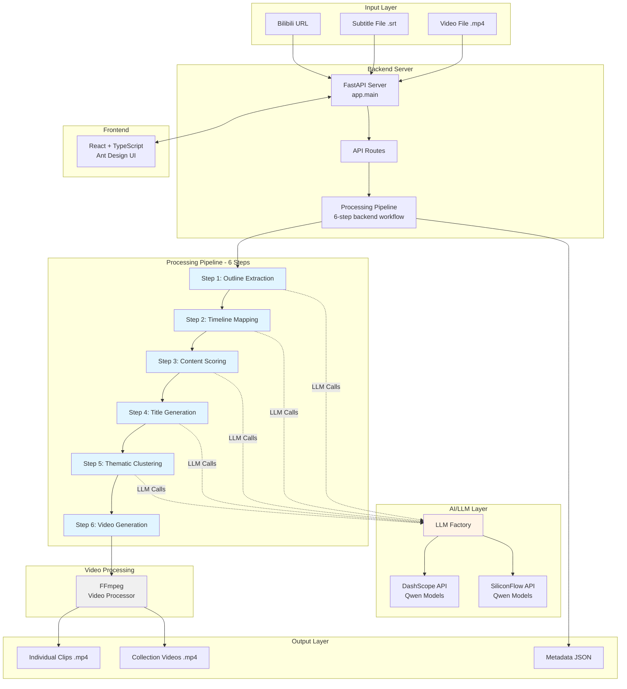
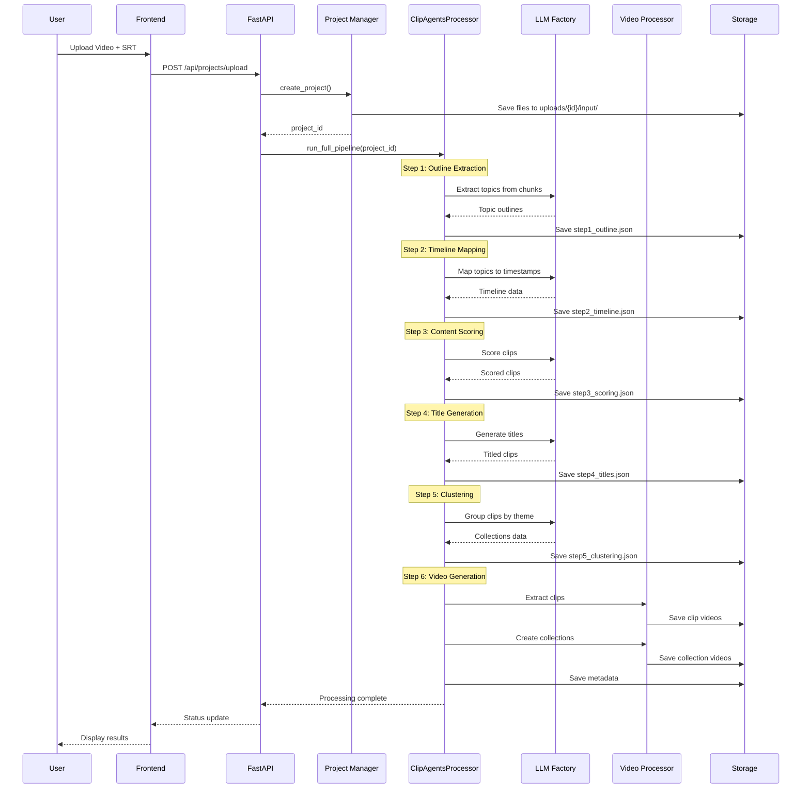
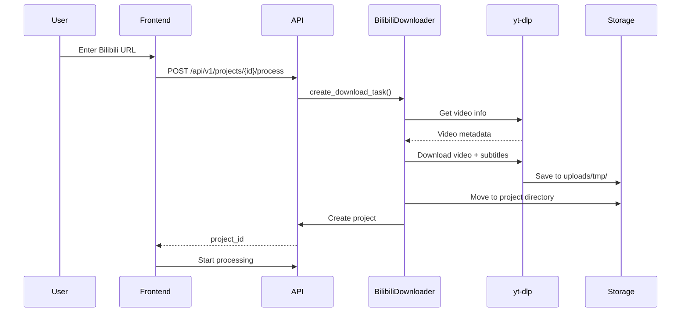

# How This Project Works - ClipAgent MVP

## 📋 Table of Contents

- [Project Overview](#project-overview)
- [High-Level Architecture](#high-level-architecture)
- [Video Processing Pipeline](#video-processing-pipeline)
- [Detailed Component Analysis](#detailed-component-analysis)
- [Data Flow Diagram](#data-flow-diagram)
- [Technology Stack](#technology-stack)
- [File Structure](#file-structure)
- [API Integration](#api-integration)
- [Configuration System](#configuration-system)
- [How Video Processing Works](#how-video-processing-works)

---

## Project Overview

**ClipAgent MVP** is an AI-powered intelligent video clipping system that automatically analyzes long-form videos and extracts the most engaging, viral-worthy short clips. The system uses Large Language Models (LLMs) to understand video content through transcripts and creates curated collections of high-quality clips optimized for social media distribution.

### Key Capabilities

- 🎬 **Automatic Video Analysis**: AI-driven content understanding through transcript analysis
- ✂️ **Intelligent Clipping**: Extracts high-value segments based on multi-dimensional scoring
- 🎯 **Smart Recommendations**: AI generates viral-optimized titles and thematic collections
- 📺 **Bilibili Integration**: Downloads videos with subtitles from Bilibili platform
- 🌐 **Web Interface**: Modern React-based UI for project management
- 🔄 **Multi-Provider Support**: Works with DashScope (Alibaba) and SiliconFlow APIs

---

## High-Level Architecture



---

## Video Processing Pipeline

The system processes videos through a sophisticated **6-step pipeline**. Each step builds upon the previous one to transform raw video content into curated, viral-worthy clips.

### Pipeline Overview

```
┌─────────────────────────────────────────────────────────────────┐
│                    VIDEO PROCESSING PIPELINE                     │
└─────────────────────────────────────────────────────────────────┘

INPUT: Video (.mp4) + Subtitles (.srt)
   │
   ├─► STEP 1: Outline Extraction
   │   └─► Extract 2-5 core topics per 30-min chunk
   │
   ├─► STEP 2: Timeline Mapping
   │   └─► Map topics to precise timestamps (90s-12min clips)
   │
   ├─► STEP 3: Content Scoring
   │   └─► Multi-dimensional scoring (0.0-1.0 scale)
   │
   ├─► STEP 4: Title Generation
   │   └─► Create viral-optimized titles
   │
   ├─► STEP 5: Thematic Clustering
   │   └─► Group clips into themed collections
   │
   └─► STEP 6: Video Generation
       └─► Extract clips using FFmpeg
   
OUTPUT: Individual Clips + Collections + Metadata
```

---

## Detailed Component Analysis

### Step 1: Outline Extraction (`step1_outline.py`)

**Purpose**: Extract structured topics from video transcripts

**Process**:
1. Parse SRT subtitle file into structured data
2. Split transcript into 30-minute chunks (5000 characters each)
3. Send each chunk to LLM with specialized prompt
4. Extract 2-5 core topics per chunk
5. Ensure 95%+ content coverage
6. Merge and deduplicate topics across chunks

**Key Features**:
- Intelligent text chunking based on time intervals
- Saves intermediate chunk files for debugging
- Caches LLM responses to avoid redundant API calls
- Targets 3-12 minute segments per topic

**Input**: 
```
SRT file → TextProcessor.parse_srt() → List of subtitle entries
```

**Output**:
```json
[
  {
    "title": "Investment Philosophy and Mindset Management",
    "subtopics": [
      "Long-term vs short-term investment strategies",
      "Psychological adjustment during market fluctuations",
      "Common retail investor mistakes"
    ],
    "chunk_index": 0
  }
]
```

---

### Step 2: Timeline Extraction (`step2_timeline.py`)

**Purpose**: Map topics to precise video timestamps using SRT subtitles

**Process**:
1. Load topic outlines from Step 1
2. Load pre-chunked SRT data
3. For each chunk, send topics + SRT data to LLM
4. LLM matches topics to specific subtitle segments
5. Validate and adjust timestamps
6. Ensure minimum 90-second duration
7. Merge adjacent short topics if needed

**Key Features**:
- Batch processing by SRT chunks
- Timestamp validation (HH:MM:SS,mmm format)
- Automatic time format conversion (SRT → FFmpeg)
- Enforces duration constraints (90s min, 12min max)

**Input**:
```json
{
  "outlines": [...],
  "srt_chunks": [...]
}
```

**Output**:
```json
[
  {
    "id": "clip_001",
    "title": "Investment Philosophy",
    "start_time": "00:05:30,140",
    "end_time": "00:12:45,500",
    "outline": "Investment strategies and mindset",
    "content": ["Subtitle text 1", "Subtitle text 2", ...],
    "chunk_index": 0
  }
]
```

---

### Step 3: Content Scoring (`step3_scoring.py`)

**Purpose**: Evaluate clips for viral potential using multi-dimensional scoring

**Scoring Dimensions**:
1. **Information Value** (0.0-1.0): Unique insights, knowledge density
2. **Emotional Resonance** (0.0-1.0): Ability to evoke strong emotions
3. **Viral Potential** (0.0-1.0): Shareable quotes, discussion triggers
4. **Structural Integrity** (0.0-1.0): Logical flow and completeness

**Process**:
1. Load timeline data from Step 2
2. For each clip, send content to LLM with scoring prompt
3. LLM evaluates on 4 dimensions
4. Calculate final score (average or weighted)
5. Filter clips below threshold (default: 0.7)
6. Generate recommendation reasons

**Key Features**:
- Category-specific scoring prompts (8 video categories)
- Configurable score threshold
- Detailed reasoning for each score
- Quality-over-quantity approach

**Output**:
```json
[
  {
    "id": "clip_001",
    "title": "Investment Philosophy",
    "start_time": "00:05:30,140",
    "end_time": "00:12:45,500",
    "final_score": 0.85,
    "recommend_reason": "High information density with practical investment strategies...",
    "outline": "...",
    "content": [...]
  }
]
```

---

### Step 4: Title Generation (`step4_title.py`)

**Purpose**: Create compelling, click-worthy titles for high-scoring clips

**Title Generation Principles**:
- ✅ Stay true to original content (no exaggeration)
- ✅ Avoid clickbait language
- ✅ Highlight core value propositions
- ✅ Keep titles concise and impactful
- ✅ Optimize for viral potential

**Process**:
1. Load scored clips from Step 3
2. For each high-scoring clip, send content to LLM
3. LLM generates 1-3 title options
4. Select best title based on criteria
5. Ensure brand safety and authenticity

**Output**:
```json
[
  {
    "id": "clip_001",
    "title": "Investment Philosophy",
    "generated_title": "Why 90% of Retail Investors Fail: The Mindset Shift You Need",
    "start_time": "00:05:30,140",
    "end_time": "00:12:45,500",
    "final_score": 0.85,
    "recommend_reason": "..."
  }
]
```

---

### Step 5: Thematic Clustering (`step5_clustering.py`)

**Purpose**: Group related clips into thematic collections

**Clustering Categories** (8 themes):
1. 💼 Investment & Finance
2. 🌟 Career & Growth
3. 💭 Social Observations
4. 🌍 Cultural Differences
5. 🎥 Live Streaming & Interaction
6. ❤️ Relationships & Psychology
7. 🏃 Health & Lifestyle
8. 📱 Content Creation & Platforms

**Process**:
1. Load titled clips from Step 4
2. Send all clips to LLM with clustering prompt
3. LLM analyzes content and groups by theme
4. Create 2-5 clips per collection
5. Generate collection titles and summaries
6. Limit to maximum 5 collections

**Collection Rules**:
- 2-5 clips per collection (optimal engagement)
- Maximum 5 collections per project
- Quality-based prioritization
- Cross-topic relationship analysis

**Output**:
```json
[
  {
    "id": "collection_001",
    "collection_title": "Investment Wisdom: From Beginner to Pro",
    "collection_summary": "Essential investment strategies and mindset shifts...",
    "clip_ids": ["clip_001", "clip_003", "clip_007"],
    "collection_type": "ai_recommended"
  }
]
```

---

### Step 6: Video Generation (`step6_video.py`)

**Purpose**: Extract actual video clips and create collection videos

**Process**:
1. Load clips metadata and collections data
2. For each clip:
   - Extract video segment using FFmpeg
   - Apply timestamp-based cutting
   - Sanitize filename
   - Save to clips directory
3. For each collection:
   - Concatenate clips using FFmpeg
   - Create collection video
   - Save to collections directory
4. Save final metadata files

**FFmpeg Operations**:
```bash
# Extract single clip
ffmpeg -i input.mp4 -ss 00:05:30.140 -to 00:12:45.500 -c copy output.mp4

# Concatenate clips for collection
ffmpeg -f concat -safe 0 -i filelist.txt -c copy collection.mp4
```

**Key Features**:
- Precise timestamp-based cutting
- Batch processing for efficiency
- File naming sanitization
- Error handling and retry logic

**Output Structure**:
```
uploads/{project_id}/output/
├── clips/
│   ├── clip_001_investment_philosophy.mp4
│   ├── clip_002_career_growth.mp4
│   └── ...
├── collections/
│   ├── collection_001_investment_wisdom.mp4
│   └── ...
└── metadata/
    ├── clips_metadata.json
    └── collections_metadata.json
```

---

## Data Flow Diagram



---

## Technology Stack

### Backend

| Component | Technology | Purpose |
|-----------|-----------|---------|
| **Web Framework** | FastAPI | RESTful API server, async support |
| **Language** | Python 3.8+ | Core processing logic |
| **AI/LLM** | DashScope / SiliconFlow | Content analysis and generation |
| **Video Processing** | FFmpeg | Video cutting and concatenation |
| **Data Storage** | JSON files | Project metadata and state |
| **Configuration** | Pydantic | Settings validation and management |

### Frontend

| Component | Technology | Purpose |
|-----------|-----------|---------|
| **Framework** | React 18 | UI component library |
| **Language** | TypeScript | Type-safe development |
| **UI Library** | Ant Design | Professional UI components |
| **Build Tool** | Vite | Fast development and building |
| **State Management** | React Hooks | Local state management |
| **HTTP Client** | Axios | API communication |

### LLM Providers

| Provider | Models | Use Case |
|----------|--------|----------|
| **DashScope** | qwen-plus, qwen-turbo, qwen-max | Alibaba Cloud LLM service |
| **SiliconFlow** | Qwen2.5-72B-Instruct, Qwen3-8B, DeepSeek-R1 | Alternative LLM provider |

---

## File Structure

```
clipping-tool-be/
├── app/                        # Active backend application code
│   ├── main.py                 # FastAPI entrypoint
│   ├── api/                    # Route handlers
│   ├── pipeline/               # 6-step clipping pipeline
│   ├── utils/                  # LLM, video, and text utilities
│   └── config.py               # Runtime configuration
├── prompts/
│   └── en/                     # English prompt templates and category packs
├── data/                       # Local settings and generated metadata
├── uploads/                    # Uploaded inputs
├── output/                     # Generated clips and collections
├── frontend/                   # Web frontend
├── docs/                       # Project documentation
├── Dockerfile                  # Container build
├── docker-compose.yml          # Local orchestration
└── requirements.txt            # Python dependencies
```

---

## API Integration

### LLM Factory Pattern

The system uses a **Factory Pattern** to abstract LLM provider selection:

```python
# LLM Factory creates appropriate client based on configuration
class LLMFactory:
    @staticmethod
    def create_client(provider, api_key, model):
        if provider == "openrouter":
            return OpenRouterClient(api_key, model)
        elif provider == "grok":
            return GrokClient(api_key, model)
```

**Benefits**:
- Easy provider switching
- Consistent interface across providers
- Centralized configuration
- Testability and mocking

### LLM Client Interface

Both clients implement a common interface:

```python
class LLMClient:
    def call(self, prompt: str, input_data: str) -> str:
        """Send request to LLM and return response"""
        
    def call_with_retry(self, prompt: str, input_data: dict, 
                       max_retries: int = 3) -> str:
        """Call with automatic retry on failure"""
```

### Prompt Engineering

The system uses **category-specific prompts** for different video types:

```
prompt_en/
├── outline.txt              # Default prompts
├── timeline.txt
├── recommendation.txt
├── title_generation.txt
├── clustering.txt
│
└── business/                # Business & Finance category
    ├── outline.txt
    ├── timeline.txt
    ├── recommendation.txt
    ├── title_generation.txt
    └── clustering.txt
```

**Prompt Selection Logic**:
```python
def get_prompt_files(video_category: str) -> Dict[str, Path]:
    category_dir = PROMPT_DIR / video_category
    if category_dir.exists():
        # Use category-specific prompts
        return load_category_prompts(category_dir)
    else:
        # Fallback to default prompts
        return DEFAULT_PROMPTS
```

---

## Configuration System

### Settings Model

```python
class Settings(BaseModel):
    # API Configuration
    api_provider: str = "openrouter"  # or "grok"
    openrouter_api_key: str = ""
    xai_api_key: str = ""
    openrouter_model: str = "tngtech/deepseek-r1t2-chimera:free"
    grok_model: str = "grok-3-mini"
    
    # Processing Parameters
    chunk_size: int = 5000
    min_score_threshold: float = 0.7
    max_clips_per_collection: int = 5
    
    # Topic Extraction Controls
    min_topic_duration_minutes: int = 2
    max_topic_duration_minutes: int = 12
    target_topic_duration_minutes: int = 5
    min_topics_per_chunk: int = 3
    max_topics_per_chunk: int = 8
```

### Configuration Sources (Priority Order)

1. **Environment Variables** (highest priority)
   ```bash
   OPENROUTER_API_KEY=sk-xxx
   API_PROVIDER=openrouter
   CHUNK_SIZE=5000
   ```

2. **Configuration File** (`data/settings.json`)
   ```json
   {
     "api_provider": "openrouter",
     "openrouter_api_key": "sk-xxx",
     "chunk_size": 5000,
     "min_score_threshold": 0.7
   }
   ```

3. **Default Values** (lowest priority)

### Video Categories

The system supports **8 video categories**, each with specialized prompts:

| Category | Icon | Description |
|----------|------|-------------|
| **Default** | 🎬 | General video content |
| **Knowledge** | 📚 | Educational, technical content |
| **Business** | 💼 | Business analysis, finance |
| **Opinion** | 💭 | Commentary, analysis |
| **Experience** | 🌟 | Life experiences, tips |
| **Speech** | 🎤 | Speeches, talks, interviews |
| **Content Review** | 🎭 | Movie/game reviews |
| **Entertainment** | 🎪 | Entertainment, variety shows |

---

## How Video Processing Works

### Complete Processing Flow

```
┌─────────────────────────────────────────────────────────────────┐
│ 1. USER UPLOADS VIDEO + SRT                                     │
└─────────────────────────────────────────────────────────────────┘
                            ↓
┌─────────────────────────────────────────────────────────────────┐
│ 2. PROJECT CREATION                                              │
│    • Generate UUID project ID                                    │
│    • Create directory structure                                  │
│    • Save files to uploads/{id}/input/                          │
│    • Initialize project metadata                                 │
└─────────────────────────────────────────────────────────────────┘
                            ↓
┌─────────────────────────────────────────────────────────────────┐
│ 3. TEXT PREPROCESSING                                            │
│    • Parse SRT file into structured data                        │
│    • Extract subtitle text with timestamps                      │
│    • Chunk text into 30-minute segments (5000 chars)           │
│    • Save chunks to metadata/step1_chunks/                     │
└─────────────────────────────────────────────────────────────────┘
                            ↓
┌─────────────────────────────────────────────────────────────────┐
│ 4. STEP 1: OUTLINE EXTRACTION                                   │
│    • Load category-specific prompt                              │
│    • For each text chunk:                                       │
│      - Send to LLM with outline prompt                          │
│      - Extract 2-5 core topics                                  │
│      - Cache LLM response                                       │
│    • Merge and deduplicate topics                              │
│    • Save to metadata/step1_outline.json                       │
└─────────────────────────────────────────────────────────────────┘
                            ↓
┌─────────────────────────────────────────────────────────────────┐
│ 5. STEP 2: TIMELINE MAPPING                                     │
│    • Load outlines and SRT chunks                               │
│    • For each chunk:                                            │
│      - Send topics + SRT data to LLM                            │
│      - LLM matches topics to timestamps                         │
│      - Validate time format (HH:MM:SS,mmm)                     │
│      - Ensure min 90s duration                                  │
│    • Convert SRT time → FFmpeg time format                     │
│    • Save to metadata/step2_timeline.json                      │
└─────────────────────────────────────────────────────────────────┘
                            ↓
┌─────────────────────────────────────────────────────────────────┐
│ 6. STEP 3: CONTENT SCORING                                      │
│    • Load timeline data                                         │
│    • For each clip:                                             │
│      - Send content to LLM with scoring prompt                  │
│      - LLM evaluates 4 dimensions (0.0-1.0):                   │
│        * Information Value                                      │
│        * Emotional Resonance                                    │
│        * Viral Potential                                        │
│        * Structural Integrity                                   │
│      - Calculate final score                                    │
│      - Generate recommendation reason                           │
│    • Filter clips below threshold (0.7)                        │
│    • Save to metadata/step3_scoring.json                       │
└─────────────────────────────────────────────────────────────────┘
                            ↓
┌─────────────────────────────────────────────────────────────────┐
│ 7. STEP 4: TITLE GENERATION                                     │
│    • Load scored clips                                          │
│    • For each high-scoring clip:                                │
│      - Send content to LLM with title prompt                    │
│      - LLM generates viral-optimized title                      │
│      - Ensure authenticity (no clickbait)                       │
│    • Save to metadata/step4_titles.json                        │
└─────────────────────────────────────────────────────────────────┘
                            ↓
┌─────────────────────────────────────────────────────────────────┐
│ 8. STEP 5: THEMATIC CLUSTERING                                  │
│    • Load titled clips                                          │
│    • Send all clips to LLM with clustering prompt              │
│    • LLM groups clips by theme (8 categories)                  │
│    • Create 2-5 clips per collection                           │
│    • Generate collection titles and summaries                   │
│    • Limit to max 5 collections                                │
│    • Save to metadata/step5_clustering.json                    │
└─────────────────────────────────────────────────────────────────┘
                            ↓
┌─────────────────────────────────────────────────────────────────┐
│ 9. STEP 6: VIDEO GENERATION                                     │
│    • Load clips and collections metadata                        │
│    • For each clip:                                             │
│      - Extract using FFmpeg                                     │
│      - ffmpeg -i input.mp4 -ss START -to END -c copy out.mp4  │
│      - Save to output/clips/                                    │
│    • For each collection:                                       │
│      - Create file list for concatenation                       │
│      - ffmpeg -f concat -i list.txt -c copy collection.mp4    │
│      - Save to output/collections/                              │
│    • Save final metadata                                        │
└─────────────────────────────────────────────────────────────────┘
                            ↓
┌─────────────────────────────────────────────────────────────────┐
│ 10. OUTPUT DELIVERY                                              │
│     • Individual clip videos (.mp4)                             │
│     • Collection videos (.mp4)                                  │
│     • Metadata files (.json)                                    │
│     • Processing logs                                           │
│     • Ready for distribution!                                   │
└─────────────────────────────────────────────────────────────────┘
```

### Processing Time Estimates

| Step | Description | Typical Duration |
|------|-------------|------------------|
| **Step 1** | Outline Extraction | 2-5 min (depends on video length) |
| **Step 2** | Timeline Mapping | 3-7 min |
| **Step 3** | Content Scoring | 2-4 min |
| **Step 4** | Title Generation | 1-3 min |
| **Step 5** | Thematic Clustering | 1-2 min |
| **Step 6** | Video Generation | 5-15 min (depends on clip count) |
| **Total** | Full Pipeline | **15-40 minutes** |

*Note: Times vary based on video length, LLM response time, and hardware performance*

---

## Key Design Decisions

### 1. **Why 6 Separate Steps?**

**Modularity and Debugging**:
- Each step can be run independently
- Easy to debug specific pipeline stages
- Can resume from any step if failure occurs
- Clear separation of concerns

**Caching and Efficiency**:
- LLM responses cached per step
- Avoid redundant API calls
- Can re-run later steps without re-processing earlier ones

### 2. **Why Chunk-Based Processing?**

**LLM Token Limits**:
- Most LLMs have token limits (4K-8K tokens)
- Long videos exceed these limits
- Chunking ensures all content fits

**Parallel Processing Potential**:
- Chunks can be processed in parallel (future optimization)
- Better resource utilization

**Quality Control**:
- Easier to validate smaller chunks
- Better error isolation

### 3. **Why Multi-Dimensional Scoring?**

**Holistic Quality Assessment**:
- Single metric insufficient for viral potential
- Different dimensions capture different aspects
- Balanced evaluation prevents bias

**Configurable Thresholds**:
- Users can adjust quality bar
- Different use cases need different thresholds

### 4. **Why Category-Specific Prompts?**

**Domain Optimization**:
- Business videos need different analysis than entertainment
- Specialized prompts improve accuracy
- Better understanding of domain-specific value

**Flexibility**:
- Easy to add new categories
- Fallback to default prompts if category missing

---

## Error Handling and Resilience

### Retry Mechanism

```python
def call_with_retry(self, prompt, input_data, max_retries=3):
    for attempt in range(max_retries):
        try:
            return self.call(prompt, input_data)
        except Exception as e:
            if attempt == max_retries - 1:
                raise
            logger.warning(f"Retry {attempt + 1}/{max_retries}")
            time.sleep(2 ** attempt)  # Exponential backoff
```

### State Persistence

- Each step saves intermediate results
- Can resume from last successful step
- Project state tracked in `projects.json`
- Processing status updated in real-time

### Graceful Degradation

- If LLM fails, uses cached responses
- If FFmpeg fails, retries with different parameters
- If scoring fails, uses default scores
- Detailed error logging for debugging

---

## Performance Optimizations

### 1. **LLM Response Caching**
- Raw responses saved to disk
- Avoid redundant API calls
- Faster re-processing

### 2. **Batch Processing**
- Process multiple chunks in sequence
- Reduce API overhead
- Better resource utilization

### 3. **FFmpeg Optimization**
- Use `-c copy` for fast copying (no re-encoding)
- Parallel clip extraction (future)
- Efficient file I/O

### 4. **Memory Management**
- Stream large files instead of loading entirely
- Clean up temporary files
- Efficient data structures

---

## Bilibili Integration

### Video Download Flow



### Features

- **Automatic subtitle extraction**
- **Browser cookie support** (for login-required videos)
- **Progress tracking**
- **Metadata extraction** (title, uploader, views, etc.)
- **Error handling** (network failures, invalid URLs)

---

## Deployment Options

### 1. **Docker Deployment (Recommended)**

```bash
# One-click deployment
./docker-deploy.sh

# Production deployment
./docker-deploy-prod.sh
```

**Benefits**:
- No environment setup required
- Consistent across platforms
- Easy updates and rollbacks
- Isolated dependencies

### 2. **Development Environment**

```bash
# Start backend
uvicorn app.main:app --reload --host 0.0.0.0 --port 8000

# Start frontend (separate terminal)
cd frontend && npm run dev
```

**Benefits**:
- Hot reload for development
- Easy debugging
- Direct access to logs

### 3. **Command Line Tool**

```bash
# Start the API server locally
uvicorn app.main:app --reload --host 0.0.0.0 --port 8000
```

**Benefits**:
- Hot reload for development
- Easy API testing with Swagger/OpenAPI
- Matches the supported backend entrypoint in this repository

---

## Future Enhancements

### Planned Features

1. **Parallel Processing**
   - Process chunks in parallel
   - Faster pipeline execution
   - Better hardware utilization

2. **Advanced Scoring**
   - Machine learning models
   - Historical performance data
   - A/B testing for titles

3. **Multi-Language Support**
   - Automatic subtitle translation
   - Multi-language prompts
   - Localized titles

4. **Cloud Storage Integration**
   - S3/OSS support
   - CDN integration
   - Distributed processing

5. **Analytics Dashboard**
   - Processing statistics
   - Quality metrics
   - Performance tracking

---

## Conclusion

ClipAgent MVP is a sophisticated AI-powered video clipping system that transforms long-form content into viral-worthy short clips through a **6-step intelligent pipeline**. By leveraging LLMs for content understanding and FFmpeg for video processing, it automates the tedious task of manual video editing while maintaining high quality standards.

The system's modular architecture, comprehensive error handling, and flexible configuration make it suitable for both individual creators and production environments. Whether you're processing educational content, business presentations, or entertainment videos, ClipAgent MVP delivers consistent, high-quality results optimized for social media distribution.

---

**For more information**:
- [README.md](README.md) - Setup and usage guide
- [DOCKER_DEPLOY.md](DOCKER_DEPLOY.md) - Docker deployment guide
- [PROJECT_ANALYSIS.md](PROJECT_ANALYSIS.md) - Technical analysis
- [WORKFLOW_DIAGRAM.md](WORKFLOW_DIAGRAM.md) - Visual workflow diagrams
